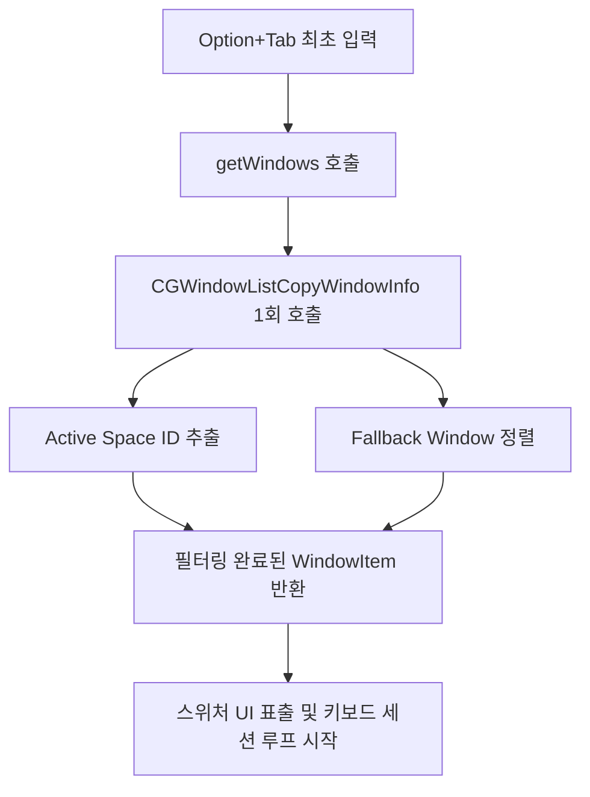

# Simple Alt Tab App - 기술 및 아키텍처 보고서 (Technical & Architecture Report)

본 보고서는 `simple-alt-tab-app` (이하 Simple Alt Tab)의 전반적인 설계 사상, 적용된 핵심 기술 표준, 데이터 정합성 보장 메커니즘, 객체 지향 및 운영체제 연동 디자인 패턴, 그리고 성능 최적화 아키텍처를 심층 분석하여 서술합니다. 

---

## 목차 (Table of Contents)
1. **어플리케이션 수명 주기 및 권한 관리 모델**
2. **전역 키보드 이벤트 모니터링 및 비동기 스레딩 설계**
3. **하이브리드 창 탐색 및 정합성 보장 아키텍처 (AXUIElement + CGWindowList)**
4. **UI 윈도우 포커싱 방지 오버레이 및 동적 렌더링 시스템**
5. **근본적 설계 패턴 및 운영체제 연동 모델**
   * *5.1 싱글톤 패턴(Singleton Pattern)을 통한 전역 상태의 독점적 제어*
   * *5.2 이벤트 드리븐(Event-Driven) 및 관찰자(Observer) 패턴 기반의 느슨한 결합*
   * *5.3 ARC 메모리 관리 모델 하에서의 백그라운드 안정성 및 순환 참조 차단*
   * *5.4 macOS App Sandbox 비활성화 정책의 불가피성과 하드웨어 보안 우회 모델*
6. **극단적 리소스 최적화 및 누수 차단 아키텍처**

---

## 1. 어플리케이션 수명 주기 및 권한 관리 모델

### 1.1 `.accessory` 활성화 정책 도입의 이유
macOS 어플리케이션은 크게 세 가지 활성화 정책(Activation Policy)을 가집니다:
* `.regular`: 일반적인 GUI 앱. Dock에 아이콘이 나타나고 메인 메뉴 바를 소유함.
* `.accessory`: Dock 아이콘이 나타나지 않고 UI 창을 띄울 수 있으나 다른 앱의 활성화를 방해하지 않는 형태.
* `.prohibited`: UI가 전혀 없고 백그라운드 데몬으로만 동작하는 형태.

Simple Alt Tab은 사용자가 단축키를 눌렀을 때만 일시적으로 화면 중앙에 창 목록을 오버레이로 보여주는 유틸리티입니다. 따라서 Dock 아이콘을 가려 시스템 UI 공간을 차지하지 않고, 현재 구동 중인 타겟 어플리케이션의 Focus 상태를 해치지 않도록 **`.accessory` 정책**을 명시적으로 도입했습니다.
```swift
NSApp.setActivationPolicy(.accessory)
```

### 1.2 비동기적 권한 폴링 및 동적 초기화 메커니즘
macOS는 Sandbox 외부의 창에 접근하거나 키 입력을 전역 가로채기 위해 고도의 보안 권한(`Accessibility` 및 `Screen Recording`)을 요구합니다. 이 권한들은 사용자가 시스템 설정에서 수동으로 켜야 하므로, 앱 실행 도중에 권한 획득 여부를 감지하고 기능을 즉각 활성화시키는 아키텍처가 필수적입니다.
* **동적 폴링 설계**: 권한이 부여되지 않았을 경우, 앱을 블로킹하거나 강제 종료하는 대신 **1초 단위의 타이머 폴링 루프**(`permissionPollTimer`)를 가동합니다.
* **레이턴시 없는 즉시 반영**: 루프 안에서 비파괴적으로 권한 상태를 확인하여 둘 다 획득되는 순간 타이머를 해제(`invalidate()`)하고 이벤트 탭(`EventMonitor.start()`)을 안전하게 구동합니다.

---

## 2. 전역 키보드 이벤트 모니터링 및 비동기 스레딩 설계

### 2.1 `CGEvent.tapCreate`를 사용한 전역 키 감지 분석
전역 핫키를 모니터링하는 일반적인 Carbon API(`RegisterEventHotKey`)나 Cocoa API(`NSEvent.addGlobalMonitorForEvents`)는 단축키를 지정하여 눌렀을 때의 동작만 트리거할 뿐, **사용자가 Modifier Key(예: Option 키)를 손에서 떼는 타이밍**을 정확하게 감지하기 어렵습니다.
* Alt-Tab 앱의 본질은 사용자가 `Option`을 누른 상태에서 `Tab`으로 목록을 순회하다가, **`Option` 키를 완전히 떼는 순간 선택한 창으로 전환**을 확정 짓는 것입니다.
* 따라서 키의 Down/Up 상태와 플래그 변경(`flagsChanged`)을 로우 레벨에서 감시해야 하므로 **CoreGraphics Event Tap (`CGEvent.tapCreate`)** 아키텍처를 도입했습니다.
* 세션 수준의 이벤트 탭(`.cgSessionEventTap`)을 활용해 시스템 이벤트 큐의 최상단에서 키 입력을 모니터링하며, 단축키 조합(`Option+Tab`, `Option+Shift+Tab`)에 해당하는 이벤트만 가로채서 숨기고(`nil` 반환으로 시스템 전파 차단), 일반 키는 그대로 통과시킵니다.

### 2.2 메인 스레드 위임을 통한 스레드 안전성 및 지연 방지
macOS의 Event Tap 콜백은 OS의 윈도우 서버 이벤트 처리 루프 위에서 직접 동기식으로 호출됩니다. 만약 콜백 내부에서 창 목록 수집, UI 프레임 계산 등 무거운 연산을 처리하면 시스템 키보드 입력 전체가 프리징(Lag)되는 치명적인 오버헤드가 발생합니다.
* **디스패치 격리 아키텍처**: 콜백 내부에서는 키 코드와 플래그 판별만 수행하고, 실제 윈도우 스위칭 제어 로직(`handleSwitch`, `handleModifiersChanged`)은 즉시 **`DispatchQueue.main.async`**로 넘겨 메인 런루프에서 비동기로 처리하게 설계되었습니다.
* 이 구조를 통해 이벤트 탭 스레드는 지연 없이 제어권을 반환하여 시스템의 전반적인 키보드 반응 속도를 100% 보장합니다.

---

## 3. 하이브리드 창 탐색 및 정합성 보장 아키텍처 (AXUIElement + CGWindowList)

### 3.1 `AXUIElement`와 `CGWindowList` API의 결합 (하이브리드 아키텍처)
macOS에서 윈도우 정보를 획득하는 방법은 크게 두 가지이나, 각각 명확한 기술적 한계가 존재합니다:
1. **`AXUIElement` (Accessibility API)**:
   * **장점**: 실행 중인 어플리케이션의 특정 윈도우 객체에 직접 포커스를 맞추거나(`kAXFocusedAttribute`), 최소화 해제, 창 올리기 등의 액션을 직접 명령할 수 있습니다.
   * **단점**: 다른 데스크톱(Space)에 있거나 화면에 가려져 보이지 않는 창 목록을 가져오지 못합니다.
2. **`CGWindowListCopyWindowInfo` (CoreGraphics Window List API)**:
   * **장점**: 현재 화면뿐만 아니라 macOS 전체 가상 데스크톱에 존재하는 모든 창의 Layer, Size, Title, ID 등의 메타데이터를 완벽하게 반환합니다.
   * **단점**: 반환값은 읽기 전용 딕셔너리(`[String: Any]`) 배열에 불과하므로, 특정 창을 실제로 조작하거나 포커싱하는 행위가 불가능합니다.

Simple Alt Tab은 이 두 API의 장점을 유기적으로 결합한 **하이브리드 파이프라인**으로 작동합니다.
* 먼저 `runningApplications`에서 regular 정책을 가진 앱들을 순회하며 `AXUIElementCopyAttributeValue`로 현재 활성화된 화면의 윈도우를 수집합니다 (`localWindowIDs`에 ID 등록).
* 만약 전체 데스크톱 범위(`scope == .allDesktops`) 모드라면, `CGWindowListCopyWindowInfo`를 호출하여 전체 창 목록을 분석한 뒤, 앞서 수집된 `localWindowIDs`에 중복 포함되지 않은 타 데스크톱의 창들을 찾아 `WindowItem` 배열에 통합합니다.
* 이 과정을 통해 사용자는 가상 데스크톱 너머의 창까지 한눈에 볼 수 있으며, 실제 창 활성화 명령 역시 동적으로 매칭되어 정상 수행됩니다.

### 3.2 MRU (Most Recently Used) 정렬 알고리즘 및 캐싱 정합성
창 전환기의 가장 직관적인 사용자 경험은 "방금 전에 썼던 창" 순서대로 리스트가 배치되는 것입니다.
* **MRU 스냅샷 캐싱**: `NSWorkspace`의 활성화 알림(`didActivateApplicationNotification`) 및 AX Focused Window 노티피케이션(`kAXFocusedWindowChangedNotification`)을 받아 들여, 포커스가 이동한 창의 식별자(`WindowKey`)를 `mruWindowKeys` 배열의 0번 인덱스에 삽입하고 기존 기록은 밀어냅니다.
* **정합성 락(Lock) 설계**: 여러 비동기 스레드 알림(Workspace 알림, AX 옵저버 콜백 등)에서 동일한 MRU 목록에 접근하므로 데이터 오염(Race Condition)을 방지하고자 `NSLock`(`mruLock`)을 도입해 스레드 세이프(Thread-Safe)하게 배열을 제어합니다.
* **최종 정렬**: `getWindows()` 결과물 반환 시, 이 캐시된 `mruWindowKeys` 인덱스를 1순위 정렬 기준으로 적용하여 사용자가 가장 빈번하게 전환한 순서대로 창 리스트를 안정적으로 배열합니다.

---

## 4. UI 윈도우 포커싱 방지 오버레이 및 동적 렌더링 시스템

### 4.1 포커스를 뺏지 않는 투명 오버레이 패널 (`NSPanel`)
단축키를 눌러 스위처 UI를 띄웠을 때, 스위처 UI 자체가 운영체제의 Focus를 가져가 버리면 기존에 타이핑 중이던 앱이 비활성화 상태가 되며 부자연스러운 화면 깜빡임이 생깁니다.
* **포커싱 방지 설계**: 이를 방지하기 위해 `NSWindow` 대신 상속 구조상 경량화된 **`NSPanel`** 클래스를 사용하며, 아래와 같은 스타일 마스크를 선언합니다.
  ```swift
  styleMask: [.borderless, .nonactivatingPanel]
  ```
* `.nonactivatingPanel` 플래그는 스위처 창이 활성화되더라도 현재 키 입력을 수신하고 있던 타겟 어플리케이션의 Active 상태를 유지시켜 줍니다.
* 레벨을 `.screenSaver`로 높게 설정하여 어떤 전체 화면 앱 위에 있더라도 최상단 오버레이로 안정적으로 표출됩니다.

### 4.2 상태값(창 개수)에 따른 동적 레이아웃 계산 및 드로잉
* **창이 0개인 경우**: 
  * 화면 높이를 한 줄 텍스트 높이 수준(`60pt`)으로 자동 압축 리사이징합니다.
  * `SwitcherView.draw` 내부에서 비어 있는 렌더링 패스를 감지하고, 커스텀 `NSMutableParagraphStyle`을 적용해 영문 문구 **"No open windows"**를 뷰 영역 내 정중앙에 선형 보간하여 드로잉합니다.
* **창이 1개 또는 N개인 경우**:
  * 창 목록 개수(`items.count`)에 각 UISize별 행 높이(`rowHeight`)와 패딩을 곱해 프레임 크기를 정비례하게 계산하여 크기를 재조정(Resize)합니다.
  * `draw` 루프 내에서 사용자가 현재 짚고 있는 포커스 인덱스(`currentIndex`) 영역만 테마 하이라이트 색상(`Theme.highlight`)으로 `NSBezierPath(roundedRect:)`를 채워 렌더링합니다.

---

## 5. 근본적 설계 패턴 및 운영체제 연동 모델

본 섹션은 본 유틸리티가 macOS 환경에서 365일 24시간 백그라운드로 실행되면서도 완벽한 안정성을 보여줄 수 있는 소프트웨어 공학적 근본 아키텍처에 대해 다룹니다.

### 5.1 싱글톤 패턴(Singleton Pattern)을 통한 전역 상태의 독점적 제어
`SwitcherManager`는 어플리케이션 전반에 걸쳐 단 하나의 공유 인스턴스(`shared`)를 소유하도록 강제되는 **싱글톤 아키텍처**를 따릅니다.
* **독점권 보장**: 운영체제 레벨의 Event Tap 콜백은 전역 정적 함수 포인터 형태로 바인딩됩니다. 만약 `SwitcherManager`가 여러 인스턴스로 동시 생성될 수 있다면, 서로 다른 스위칭 상태(`isSwitching`) 및 인덱스 상태가 꼬이거나 키보드 이벤트를 중복 인터셉트하는 비동기 레이스 컨디션이 필연적으로 발생합니다.
* **구현 세부**: `private init()`을 통해 외부에서의 추가 인스턴스 생성을 근본적으로 통제하고, `shared` 전역 정적 상수를 유일한 진입점으로 제공함으로써 전체 단축키 상태를 오직 하나의 인스턴스 내에서 스레드 세이프하게 관리합니다.

### 5.2 이벤트 드리븐(Event-Driven) 및 관찰자(Observer) 패턴 기반의 느슨한 결합
이 프로그램은 특정 앱의 생명주기를 능동적으로 폴링하여 확인하지 않습니다. 대신, macOS 운영체제의 알림 센터 시스템과 느슨하게 결합된 **관찰자 패턴**으로 통신합니다.
* **NotificationCenter 연동**: `NSWorkspace.shared.notificationCenter`를 통해 새 앱의 실행(`didLaunch`), 포커스 변경(`didActivate`), 앱의 종료(`didTerminate`) 이벤트를 수동적(Reactive)으로 수신합니다.
* **AXObserver를 통한 정밀 알림**: 실행 중인 어플리케이션 중 regular 활성화 정책을 가진 프로세스에 대해 프로세스 내 윈도우 포커스 변동(`kAXFocusedWindowChangedNotification`) 알림을 직접 구독합니다.
* **이점**: 앱이 가동되는 대부분의 시간 동안 별도의 CPU 소비 루프가 가동되지 않으며, OS가 분배하는 메시지 루프에 전적으로 기댄 채 Idle 상태를 유지하므로 전력 소모량이 0%에 수렴하는 극도로 친환경적인 구조가 완성됩니다.

### 5.3 ARC 메모리 관리 모델 하에서의 백그라운드 안정성 및 순환 참조 차단
Swift는 가비지 컬렉터(Garbage Collector) 없이 객체의 참조 횟수를 계산하여 자동으로 메모리를 해제하는 **ARC(Automatic Reference Counting)**를 활용합니다. 이 백그라운드 도구는 메모리 누수가 조금이라도 발생하면 시간이 지남에 따라 메모리가 기하급수적으로 증가(Memory Leak)하여 결국 시스템의 성능 저하를 초래합니다.
* **순환 참조(Retain Cycle) 방지**: `NotificationCenter.default` 및 `AXObserver`의 콜백으로 전달되는 Swift의 Closure(클로저)들은 주변 객체들의 강한 참조를 획득하기 쉽습니다. 
* 이를 차단하기 위해 모든 클로저 선언부 내에 **`[weak self]`** 또는 **`[weak timer]`** 등의 캡처 리스트(Capture List)를 철저히 지정했습니다. 
* **해제 정합성**: 캡처된 `self`가 `nil`이 될 경우 조기에 실행을 중단(Guard Clause)함으로써, 소유권 체인이 꼬여 발생하는 메모리 잔존 가능성을 근본적으로 제거했습니다.

### 5.4 macOS App Sandbox 비활성화 정책의 불가피성과 하드웨어 보안 우회 모델
macOS는 기본적으로 어플리케이션의 독립적인 격리를 위해 App Sandbox 보안 아키텍처를 권장합니다. 하지만 이 앱은 샌드박스를 명시적으로 비활성화(`ENABLE_APP_SANDBOX=NO`)하는 설정을 사용하고 있습니다.
* **불가피성 분석**: 샌드박스가 켜지면 OS의 프로세스 격리 원칙(Process Isolation)이 엄격히 적용되어 아래 3가지 로우 레벨 API 호출이 하드웨어 보안 레이어에 의해 차단됩니다:
  1. `CGEvent.tapCreate`: 다른 앱으로 향하는 전역 키보드 입력 스트림에 개입하는 행위
  2. `AXUIElementCreateApplication`: 다른 앱의 창(Window) 객체 계층에 접근하여 포커스를 변경하는 행위
  3. `CGWindowListCopyWindowInfo`: 타 프로세스의 윈도우 타이틀 및 메타데이터를 수집하는 행위
* **안전 서명**: 비-샌드박스 앱으로서의 신뢰성을 증명하기 위해, 빌드 타임 시 로컬 개발자 인증서로 코드 서명(`codesign --sign -`)을 거친 후 macOS Launch Services에 공식 신뢰 가능한 번들 어플리케이션으로 수동 등록(`lsregister`)하는 아키텍처적 검증 파이프라인을 포함하고 있습니다.

---

## 6. 극단적 리소스 최적화 및 누수 차단 아키텍처

최근 추가 적용된 아키텍처적 개선으로, macOS 시스템 레벨에서 CPU 오버헤드와 물리 메모리 사용량을 최소한으로 유도하도록 구성되었습니다.



### 6.1 System Call 및 컨텍스트 스위칭 최소화 (CGWindowList 1회 통합)
기존에는 단축키 전환 시점에 `getWindows` 호출 한 번에 여러 번의 `CGWindowListCopyWindowInfo`가 수반되었습니다. 이 API 호출은 운영체제의 Window Server(프로세스 외 영역)와 통신하여 데이터를 가져오는 무겁고 깊은 System Call입니다.
* **단일 엔트리 포인트 주입 설계**: `getWindows()` 초입에서 스냅샷 `onScreenInfos`를 1회만 받아온 뒤, `getActiveSpaceWindowIDs(from:)`와 `fallbackWindowOrder(from:)` 메서드에 배열 자체를 Reference 파라미터로 주입하여 내부적 호출을 제거했습니다.
* **효과**: 전환 기동 속도가 단축되었으며, Window Server 커널 레벨의 컨텍스트 스위칭으로 인한 CPU 스파이크가 대폭 억제되었습니다.

### 6.2 런루프 리소스 클린업을 통한 백그라운드 누수 방지
`AXObserver`는 생성 시 Target PID의 이벤트를 수신하기 위해 메인 RunLoop에 RunLoop Source를 결합시킵니다.
* **기존의 한계**: 단순히 Swift 딕셔너리에서 `removeValue`를 수행하는 경우, CoreFoundation 객체의 RC(참조 횟수)는 정리될 수 있으나 런루프 상에 등록되었던 이벤트 소스 커널 자원은 좀비 상태로 누적될 우려가 높았습니다.
* **해결 아키텍처**: 앱 종료 Notification 시점에 딕셔너리 값 해제 직전 **`CFRunLoopRemoveSource`**를 명시적으로 실행하여 해당 PID와 연결되어 돌고 있던 커널 이벤트 소스를 완벽하게 격리 및 소멸시킵니다.

### 6.3 Live Preview 상태 보존 및 중복 시그널 캐싱 (Session Caching)
마우스 호버나 키보드 연속 입력을 통해 인덱스가 변경될 때, 앱 프리뷰 기능은 매번 백그라운드 앱을 깨우고 활성화하는 OS 이벤트를 쏩니다. 만약 동일한 인덱스에 마우스가 미세하게 떨리며 호버 이벤트가 중복 유입되거나, 키보드가 멈추어 있는 경우에도 불필요한 시그널이 전송됩니다.
* **세션 캐싱 설계**: `SwitcherManager` 내부에 `lastPreviewedKey` 변수를 정의합니다.
* 사용자가 다른 창으로 포커스 대상을 바꾸지 않았다면, 0.12초 딜레이 타이머가 트리거되어도 `lastPreviewedKey == target.key` 비교 연산을 통해 작업을 바로 무시(Early Return)시킵니다.
* 이 캐시는 단축키 세션이 끝나는 `cancelSwitch()` 시점에 즉시 `nil`로 플러시되어 다음 전환 시 깨끗한 정합성을 보장합니다.
